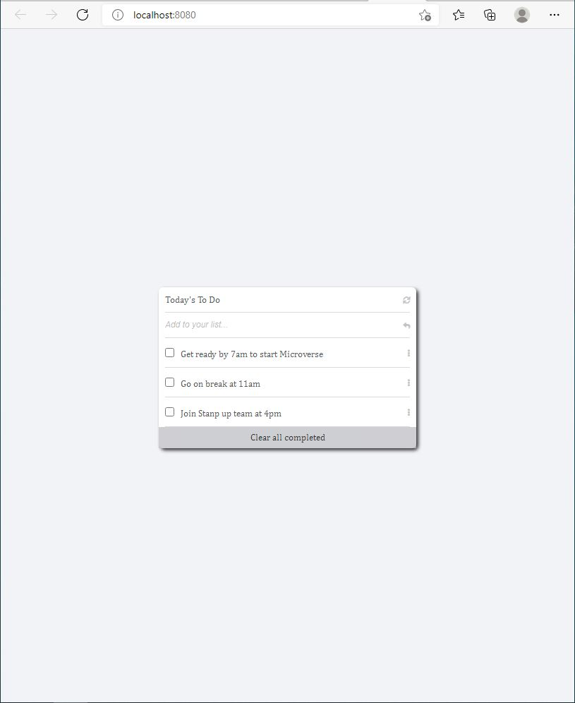

# To-Do-list-App

Assignment from Microverse where I'm going to develop To-Do list app with add and remove functions.
## Live Demo

[Live Demo Link](https://mprotic123.github.io/to-do-list/dist)

## Built With

- Html
- Css
- JavaScript

##  Prerequisites

- Visual Studio
- Git
- Html
- Css

## Getting Started

To get a local copy up and running follow these simple example steps.

- You can clone this repo by typing git clone `https://github.com/mprotic123/to-do-list.git` on your GitBash terminal

- Type cd `To-Do-list-App` to navigate through project files

- Run `npm install` from your editor's terminal.

- Run `npm run build` from your editor's terminal.

- Run `npm start` from your editor's terminal to view the project in your browser.

## Author

👤 **Milan Protić**

- GitHub: [@github](https://github.com/mprotic123)
- LinkedIn: [LinkedIn](https://www.linkedin.com/in/milan-proti%C4%87-040364213/)

## 🤝 Contributing

Contributions, issues, and feature requests are welcome!

Feel free to check the [issues page](https://github.com/mprotic123/to-do-list/issues).

## Show your support

Give a ⭐️ if you like this project!

## 📝 License

This project is [MIT](./MIT.md) licensed.

